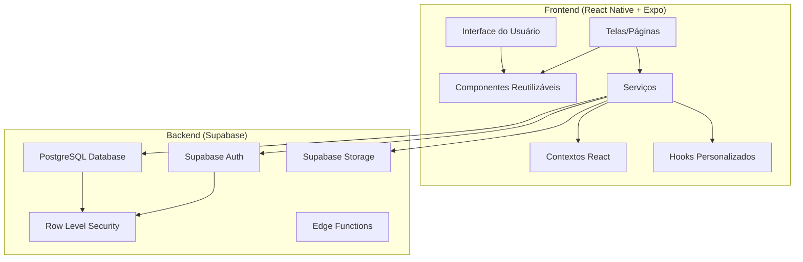

# Documento de Design - Sistema Completo DominoMania

## Visão Geral

O DominoMania é um aplicativo móvel e web desenvolvido em React Native com Expo, utilizando Supabase como backend. O sistema implementa uma arquitetura em camadas com separação clara de responsabilidades, seguindo princípios de Domain-Driven Design (DDD) e Clean Architecture.

## Arquitetura

### Arquitetura Geral



### Estrutura de Pastas

```
src/
├── app/                    # Expo Router - Páginas e navegação
│   ├── (tabs)/            # Navegação por abas
│   ├── (pages)/           # Páginas específicas
│   └── _layout.tsx        # Layout principal
├── components/            # Componentes reutilizáveis
│   ├── ui/               # Componentes básicos (Button, Input, etc.)
│   ├── layout/           # Componentes de layout
│   ├── feedback/         # Modais, alertas, loading
│   └── data-display/     # Listas, gráficos, estatísticas
├── features/             # Domínios organizados por funcionalidade
│   ├── auth/            # Autenticação
│   ├── players/         # Gerenciamento de jogadores
│   ├── communities/     # Gerenciamento de comunidades
│   ├── competitions/    # Gerenciamento de competições
│   ├── games/           # Gerenciamento de jogos
│   └── statistics/      # Estatísticas e rankings
├── services/            # Serviços para comunicação com APIs
├── contexts/            # Contextos React para estado global
├── hooks/               # Hooks personalizados
├── lib/                 # Configurações de bibliotecas externas
├── types/               # Definições de tipos TypeScript
├── utils/               # Funções utilitárias
└── theme/               # Configurações de tema e estilos
```

## Componentes e Interfaces

### Componentes Principais

#### 1. Sistema de Autenticação
- **AuthProvider**: Contexto global para gerenciar estado de autenticação
- **LoginScreen**: Tela de login com validação
- **RegisterScreen**: Tela de registro com criação de perfil
- **ForgotPasswordScreen**: Recuperação de senha

#### 2. Gerenciamento de Jogadores
- **PlayersList**: Lista de jogadores com separação (Meus/Comunidades)
- **PlayerCard**: Card individual do jogador com estatísticas
- **PlayerForm**: Formulário para criar/editar jogador
- **PlayerAvatar**: Componente para exibir/editar avatar

#### 3. Sistema de Comunidades
- **CommunityList**: Lista de comunidades (Criadas/Organizadas)
- **CommunityCard**: Card da comunidade com estatísticas
- **CommunityForm**: Formulário para criar/editar comunidade
- **CommunityDetails**: Detalhes da comunidade com membros e competições

#### 4. Sistema de Competições
- **CompetitionList**: Lista de competições por comunidade
- **CompetitionCard**: Card da competição com status
- **CompetitionForm**: Formulário para criar competição
- **CompetitionDetails**: Detalhes com membros, jogos e resultados

#### 5. Sistema de Jogos
- **GameList**: Lista de jogos da competição
- **GameCard**: Card do jogo com placar e status
- **GameForm**: Formulário para criar jogo com seleção de equipes
- **GameDetails**: Detalhes do jogo com histórico de rodadas
- **RoundForm**: Formulário para registrar rodadas

#### 6. Estatísticas e Rankings
- **Dashboard**: Painel principal com estatísticas do usuário
- **PlayerRanking**: Ranking de jogadores com filtros
- **PairRanking**: Ranking de duplas
- **StatisticsChart**: Gráficos de estatísticas

## Modelos de Dados

### Estrutura do Banco de Dados

#### Tabelas Principais

```sql
-- Usuários e Perfis
CREATE TABLE user_profiles (
    id UUID PRIMARY KEY DEFAULT gen_random_uuid(),
    user_id UUID REFERENCES auth.users(id) ON DELETE CASCADE,
    full_name TEXT NOT NULL,
    phone_number TEXT,
    nickname TEXT,
    created_at TIMESTAMP WITH TIME ZONE DEFAULT NOW(),
    updated_at TIMESTAMP WITH TIME ZONE DEFAULT NOW()
);

-- Jogadores
CREATE TABLE players (
    id UUID PRIMARY KEY DEFAULT gen_random_uuid(),
    name TEXT NOT NULL,
    phone TEXT UNIQUE NOT NULL,
    nickname TEXT,
    avatar_url TEXT,
    created_by UUID REFERENCES auth.users(id) ON DELETE CASCADE,
    is_active BOOLEAN DEFAULT TRUE,
    created_at TIMESTAMP WITH TIME ZONE DEFAULT NOW(),
    updated_at TIMESTAMP WITH TIME ZONE DEFAULT NOW()
);

-- Relação Usuário-Jogador
CREATE TABLE user_player_relations (
    id UUID PRIMARY KEY DEFAULT gen_random_uuid(),
    user_id UUID REFERENCES auth.users(id) ON DELETE CASCADE,
    player_id UUID REFERENCES players(id) ON DELETE CASCADE,
    is_primary BOOLEAN DEFAULT FALSE,
    created_at TIMESTAMP WITH TIME ZONE DEFAULT NOW(),
    UNIQUE(user_id, player_id)
);

-- Comunidades
CREATE TABLE communities (
    id UUID PRIMARY KEY DEFAULT gen_random_uuid(),
    name TEXT NOT NULL,
    description TEXT,
    created_by UUID REFERENCES auth.users(id) ON DELETE CASCADE,
    disabled BOOLEAN DEFAULT FALSE,
    created_at TIMESTAMP WITH TIME ZONE DEFAULT NOW(),
    updated_at TIMESTAMP WITH TIME ZONE DEFAULT NOW()
);

-- Organizadores de Comunidade
CREATE TABLE community_organizers (
    id UUID PRIMARY KEY DEFAULT gen_random_uuid(),
    community_id UUID REFERENCES communities(id) ON DELETE CASCADE,
    user_id UUID REFERENCES auth.users(id) ON DELETE CASCADE,
    created_by UUID REFERENCES auth.users(id) ON DELETE CASCADE,
    created_at TIMESTAMP WITH TIME ZONE DEFAULT NOW(),
    UNIQUE(community_id, user_id)
);

-- Membros de Comunidade
CREATE TABLE community_members (
    id UUID PRIMARY KEY DEFAULT gen_random_uuid(),
    community_id UUID REFERENCES communities(id) ON DELETE CASCADE,
    player_id UUID REFERENCES players(id) ON DELETE CASCADE,
    created_by UUID REFERENCES auth.users(id) ON DELETE CASCADE,
    created_at TIMESTAMP WITH TIME ZONE DEFAULT NOW(),
    UNIQUE(community_id, player_id)
);

-- Competições
CREATE TABLE competitions (
    id UUID PRIMARY KEY DEFAULT gen_random_uuid(),
    name TEXT NOT NULL,
    description TEXT,
    community_id UUID REFERENCES communities(id) ON DELETE CASCADE,
    start_date TIMESTAMP WITH TIME ZONE DEFAULT NOW(),
    end_date TIMESTAMP WITH TIME ZONE,
    status TEXT DEFAULT 'pending' CHECK (status IN ('pending', 'in_progress', 'finished', 'cancelled')),
    created_by UUID REFERENCES auth.users(id) ON DELETE CASCADE,
    created_at TIMESTAMP WITH TIME ZONE DEFAULT NOW(),
    updated_at TIMESTAMP WITH TIME ZONE DEFAULT NOW()
);

-- Membros de Competição
CREATE TABLE competition_members (
    id UUID PRIMARY KEY DEFAULT gen_random_uuid(),
    competition_id UUID REFERENCES competitions(id) ON DELETE CASCADE,
    player_id UUID REFERENCES players(id) ON DELETE CASCADE,
    created_at TIMESTAMP WITH TIME ZONE DEFAULT NOW(),
    UNIQUE(competition_id, player_id)
);

-- Jogos
CREATE TABLE games (
    id UUID PRIMARY KEY DEFAULT gen_random_uuid(),
    competition_id UUID REFERENCES competitions(id) ON DELETE CASCADE,
    team1 UUID[] NOT NULL,
    team2 UUID[] NOT NULL,
    team1_score INTEGER DEFAULT 0,
    team2_score INTEGER DEFAULT 0,
    rounds JSONB DEFAULT '[]',
    status TEXT DEFAULT 'pending' CHECK (status IN ('pending', 'in_progress', 'finished')),
    last_round_was_tie BOOLEAN DEFAULT FALSE,
    team1_was_losing_5_0 BOOLEAN DEFAULT FALSE,
    team2_was_losing_5_0 BOOLEAN DEFAULT FALSE,
    is_buchuda BOOLEAN DEFAULT FALSE,
    is_buchuda_de_re BOOLEAN DEFAULT FALSE,
    created_at TIMESTAMP WITH TIME ZONE DEFAULT NOW(),
    updated_at TIMESTAMP WITH TIME ZONE DEFAULT NOW()
);

-- Jogadores por Jogo (para facilitar consultas)
CREATE TABLE game_players (
    id UUID PRIMARY KEY DEFAULT gen_random_uuid(),
    game_id UUID REFERENCES games(id) ON DELETE CASCADE,
    player_id UUID REFERENCES players(id) ON DELETE CASCADE,
    player_name TEXT NOT NULL,
    team INTEGER NOT NULL CHECK (team IN (1, 2)),
    is_winner BOOLEAN DEFAULT FALSE,
    is_buchuda BOOLEAN DEFAULT FALSE,
    created_at TIMESTAMP WITH TIME ZONE DEFAULT NOW(),
    updated_at TIMESTAMP WITH TIME ZONE DEFAULT NOW(),
    UNIQUE(game_id, player_id)
);

-- Atividades do Sistema
CREATE TABLE activities (
    id UUID PRIMARY KEY DEFAULT gen_random_uuid(),
    user_id UUID REFERENCES auth.users(id) ON DELETE CASCADE,
    type TEXT NOT NULL CHECK (type IN ('player', 'community', 'competition', 'game')),
    description TEXT NOT NULL,
    metadata JSONB DEFAULT '{}',
    created_at TIMESTAMP WITH TIME ZONE DEFAULT NOW()
);

-- Papéis de Usuário
CREATE TABLE user_roles (
    id UUID PRIMARY KEY DEFAULT gen_random_uuid(),
    user_id UUID REFERENCES auth.users(id) ON DELETE CASCADE,
    role TEXT NOT NULL CHECK (role IN ('admin', 'organizer', 'user')),
    created_at TIMESTAMP WITH TIME ZONE DEFAULT NOW(),
    UNIQUE(user_id, role)
);
```

### Interfaces TypeScript

```typescript
// Tipos de Usuário
export interface UserProfile {
    id: string;
    user_id: string;
    full_name: string;
    phone_number?: string;
    nickname?: string;
    created_at: string;
    updated_at: string;
}

// Tipos de Jogador
export interface Player {
    id: string;
    name: string;
    phone: string;
    nickname?: string;
    avatar_url?: string;
    created_by: string;
    is_active: boolean;
    created_at: string;
    updated_at: string;
    // Campos calculados
    isMine?: boolean;
    isLinkedUser?: boolean;
    isPrimaryUser?: boolean;
    stats?: PlayerStats;
}

export interface PlayerStats {
    total_games: number;
    wins: number;
    losses: number;
    buchudas: number;
    buchudas_de_re: number;
    win_rate: number;
}

// Tipos de Comunidade
export interface Community {
    id: string;
    name: string;
    description?: string;
    created_by: string;
    disabled: boolean;
    created_at: string;
    updated_at: string;
    // Campos calculados
    members_count: number;
    competitions_count: number;
    is_organizer?: boolean;
}

// Tipos de Competição
export interface Competition {
    id: string;
    name: string;
    description?: string;
    community_id: string;
    start_date: string;
    end_date?: string;
    status: 'pending' | 'in_progress' | 'finished' | 'cancelled';
    created_by: string;
    created_at: string;
    updated_at: string;
}

// Tipos de Jogo
export interface Game {
    id: string;
    competition_id: string;
    team1: string[];
    team2: string[];
    team1_score: number;
    team2_score: number;
    rounds: GameRound[];
    status: 'pending' | 'in_progress' | 'finished';
    last_round_was_tie: boolean;
    team1_was_losing_5_0: boolean;
    team2_was_losing_5_0: boolean;
    is_buchuda: boolean;
    is_buchuda_de_re: boolean;
    created_at: string;
    updated_at: string;
}

export interface GameRound {
    type: 'simple' | 'carroca' | 'la_e_lo' | 'cruzada' | 'contagem' | 'empate';
    winner_team: 1 | 2 | null;
    has_bonus: boolean;
}

// Tipos de Atividade
export interface Activity {
    id: string;
    user_id: string;
    type: 'player' | 'community' | 'competition' | 'game';
    description: string;
    metadata: Record<string, any>;
    created_at: string;
}
```

## Tratamento de Erros

### Estratégia de Tratamento de Erros

#### 1. Camadas de Tratamento
- **Frontend**: Validação de formulários e feedback visual
- **Serviços**: Tratamento de erros de API e transformação de mensagens
- **Backend**: Row Level Security e validações de integridade

#### 2. Tipos de Erro
```typescript
export interface AppError {
    code: string;
    message: string;
    details?: any;
    timestamp: string;
}

export class ValidationError extends Error {
    constructor(message: string, public field?: string) {
        super(message);
        this.name = 'ValidationError';
    }
}

export class AuthenticationError extends Error {
    constructor(message: string = 'Usuário não autenticado') {
        super(message);
        this.name = 'AuthenticationError';
    }
}

export class AuthorizationError extends Error {
    constructor(message: string = 'Acesso negado') {
        super(message);
        this.name = 'AuthorizationError';
    }
}
```

#### 3. Sistema de Retry
```typescript
export async function withRetry<T>(
    operation: () => Promise<T>,
    maxRetries: number = 3,
    baseDelay: number = 1000
): Promise<T> {
    let lastError: Error;
    
    for (let attempt = 1; attempt <= maxRetries; attempt++) {
        try {
            return await operation();
        } catch (error) {
            lastError = error as Error;
            
            if (attempt === maxRetries) {
                throw lastError;
            }
            
            const delay = baseDelay * Math.pow(2, attempt - 1);
            await new Promise(resolve => setTimeout(resolve, delay));
        }
    }
    
    throw lastError!;
}
```

## Estratégia de Testes

### Tipos de Teste

#### 1. Testes Unitários
- Funções utilitárias
- Hooks personalizados
- Serviços de API
- Componentes isolados

#### 2. Testes de Integração
- Fluxos completos de usuário
- Integração com Supabase
- Navegação entre telas

#### 3. Testes E2E
- Cenários críticos de negócio
- Fluxos de autenticação
- Criação e gerenciamento de jogos

### Estrutura de Testes

```typescript
// Exemplo de teste de serviço
describe('PlayerService', () => {
    beforeEach(() => {
        // Setup do ambiente de teste
    });

    describe('create', () => {
        it('deve criar um novo jogador com dados válidos', async () => {
            const playerData = {
                name: 'João Silva',
                phone: '11999999999'
            };
            
            const result = await playerService.create(playerData);
            
            expect(result).toBeDefined();
            expect(result.name).toBe(playerData.name);
            expect(result.phone).toBe(playerData.phone);
        });

        it('deve vincular jogador existente se telefone já existe', async () => {
            // Teste de vinculação de jogador existente
        });
    });
});
```

## Segurança

### Row Level Security (RLS)

#### 1. Políticas de Segurança
```sql
-- Jogadores: usuários só veem jogadores que criaram ou das comunidades que organizam
CREATE POLICY "Usuários podem ver jogadores relevantes" ON players
FOR SELECT USING (
    created_by = auth.uid() OR
    EXISTS (
        SELECT 1 FROM community_members cm
        JOIN community_organizers co ON co.community_id = cm.community_id
        WHERE cm.player_id = players.id AND co.user_id = auth.uid()
    )
);

-- Comunidades: usuários veem comunidades que criaram ou organizam
CREATE POLICY "Usuários podem ver comunidades relevantes" ON communities
FOR SELECT USING (
    created_by = auth.uid() OR
    EXISTS (
        SELECT 1 FROM community_organizers co
        WHERE co.community_id = communities.id AND co.user_id = auth.uid()
    )
);

-- Jogos: usuários veem jogos das competições que participam
CREATE POLICY "Usuários podem ver jogos relevantes" ON games
FOR SELECT USING (
    EXISTS (
        SELECT 1 FROM competition_members cm
        JOIN players p ON cm.player_id = p.id
        WHERE cm.competition_id = games.competition_id
        AND p.created_by = auth.uid()
    )
);
```

#### 2. Validações de Integridade
- Verificação de limites (comunidades, competições, jogos)
- Validação de relacionamentos
- Controle de acesso baseado em papéis

### Autenticação e Autorização

#### 1. Fluxo de Autenticação
```typescript
export class AuthService {
    async signUp(email: string, password: string, name: string) {
        // 1. Criar conta no Supabase Auth
        const { data, error } = await supabase.auth.signUp({
            email,
            password,
            options: { data: { name } }
        });
        
        if (error) throw error;
        
        // 2. Criar perfil do usuário
        if (data.user) {
            await this.createUserProfile(data.user.id, name, email);
        }
        
        return data;
    }
    
    async signIn(email: string, password: string) {
        const { data, error } = await supabase.auth.signInWithPassword({
            email,
            password
        });
        
        if (error) throw error;
        return data;
    }
}
```

## Performance e Otimização

### Estratégias de Performance

#### 1. Otimização de Queries
- Uso de índices apropriados
- Paginação de resultados
- Lazy loading de dados

#### 2. Cache e Estado
- Cache local com AsyncStorage
- Estado global otimizado com Context API
- Invalidação inteligente de cache

#### 3. Otimização de Imagens
- Compressão automática de avatares
- URLs otimizadas do Supabase Storage
- Lazy loading de imagens

### Monitoramento

#### 1. Logs e Métricas
```typescript
export class Logger {
    static info(message: string, metadata?: any) {
        console.log(`[INFO] ${message}`, metadata);
        // Enviar para serviço de monitoramento
    }
    
    static error(message: string, error: Error, metadata?: any) {
        console.error(`[ERROR] ${message}`, error, metadata);
        // Enviar para serviço de monitoramento
    }
}
```

#### 2. Analytics
- Tracking de eventos importantes
- Métricas de uso e performance
- Monitoramento de erros

## Deployment e Ambientes

### Ambientes

#### 1. Desenvolvimento
- Supabase Project: `dominomaniaApp_dev`
- URL: `https://zciflougwvuosvmulftn.supabase.co`
- Configuração: `.env.development`

#### 2. Produção
- Supabase Project: `dominomaniaApp_prod`
- URL: `https://euqnfrvptiriujrdebpr.supabase.co`
- Configuração: `.env.production`

### Pipeline de Deploy

#### 1. Build e Testes
```bash
# Instalar dependências
npm install

# Executar testes
npm test

# Build para produção
npm run build
```

#### 2. Deploy Mobile
```bash
# Android
eas build --platform android --profile production

# iOS
eas build --platform ios --profile production

# Submissão para stores
eas submit --platform all
```

#### 3. Deploy Web
```bash
# Build web
npm run web:build

# Deploy para Vercel/Netlify
npm run deploy
```

## Considerações Futuras

### Funcionalidades Planejadas

#### 1. Sistema de Notificações
- Push notifications para eventos importantes
- Notificações in-app
- Sistema de preferências

#### 2. Modo Offline
- Sincronização de dados
- Cache inteligente
- Resolução de conflitos

#### 3. Analytics Avançados
- Dashboards personalizados
- Relatórios detalhados
- Exportação de dados

#### 4. Integração Social
- Compartilhamento de resultados
- Convites via WhatsApp
- Feed social de atividades

### Melhorias Técnicas

#### 1. Arquitetura
- Migração para micro-frontends
- Implementação de Event Sourcing
- Cache distribuído

#### 2. Performance
- Server-side rendering
- Code splitting avançado
- Otimização de bundle

#### 3. Segurança
- Auditoria de segurança
- Criptografia end-to-end
- Compliance com LGPD